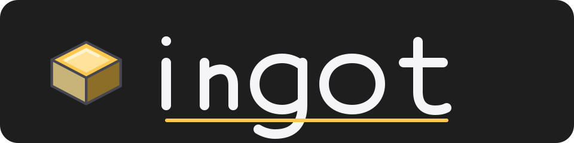
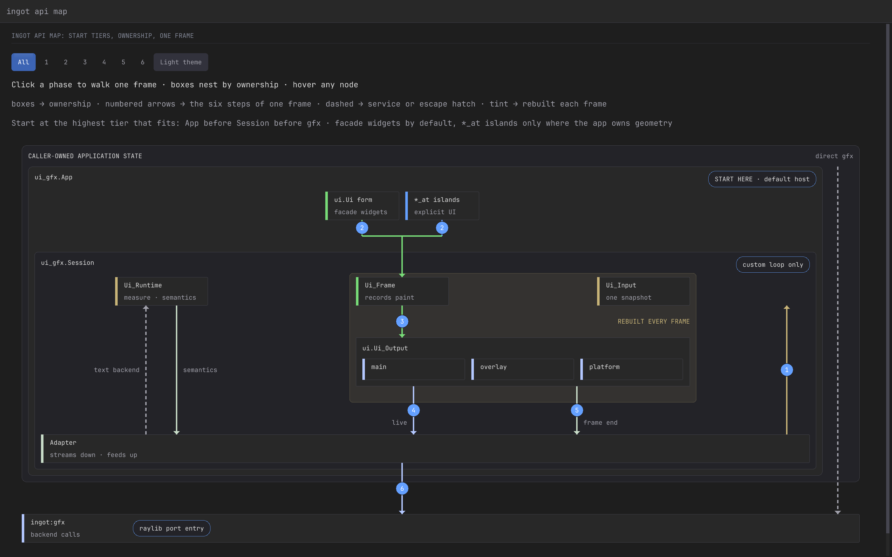

<p align="center">
  
</p>

<p align="center">
  <strong>The Odin app framework for polished native and web desktop tools-without Electron.</strong>
</p>

<p align="center">
  <a href="LICENSE"></a>
  <a href="CHANGELOG.md"></a>
</p>

<p align="center">
  <a href="https://openalloy.ai/ingot">Live demo and benchmarks</a> ·
  <a href="#why-ingot">Why Ingot</a> ·
  <a href="#quick-start">Quick start</a> ·
  <a href="#see-it-running">Gallery</a> ·
  <a href="#documentation">Documentation</a>
</p>

Ingot is a self-contained immediate-mode app framework with game-engine DNA,
built on Odin's bundled `vendor:wgpu`. One renderer targets macOS/Metal,
Windows/D3D12, Linux/Vulkan, and browser WASM/WebGPU. Two-dimensional games are
supported; polished desktop tools are the mission.

> [!IMPORTANT]
> `0.1.5` is the latest source tag for a young `0.x` API. Source releases may
> contain breaking changes, and target-specific production validation is not
> yet recorded. Pin an exact revision and validate every platform your
> application ships on.

## The experiment

Ingot asks whether deterministic simulation testing can shape an application
framework from its first subsystem rather than being added after the design has
settled. Application state stays explicit, nondeterminism is confined to
compile-gated seams, and seeded harnesses drive the code that ships—real
widgets and text editing, HTTP and WebSocket failures, worker synchronization,
terminal pumping, and selected GPU lifetimes—without a window, GPU, network,
shell, or assistive technology. This is evidence about one engineering
approach, not a claim that simulation proves correctness or that Ingot is
production-proven; each target still needs validation on the systems an
application ships on. See [Testing Ingot](docs/testing.md) for commands and
exact scope.

## Why Ingot

| | |
|---|---|
| **One source, native + web** | Target macOS/Metal, Windows/D3D12, Linux/Vulkan, and browser WASM/WebGPU through one renderer and a small platform seam. |
| **Immediate mode all the way up** | Application state remains authoritative while each required frame derives interaction, focus, overlays, accessibility semantics, platform output, and paint. |
| **Built for desktop tools** | Windowing, batched 2D rendering, widgets, text, audio, gamepads, settings, networking, accessibility, and an optional terminal stack live in one framework. |
| **Idle when your app is idle** | Event-driven applications can skip UI construction and GPU submission until input, application work, or a redraw deadline requires a frame. |
| **Raylib-shaped graphics** | Familiar common-2D names ease migration without claiming complete raylib, raymath, shader, 3D, or `rlgl` parity. |
| **Testable by construction** | Explicit state and bounded output let deterministic harnesses drive production widgets and inspect focus, routing, semantics, and resource lifetimes. |

<details>
<summary><strong>Why the immediate-mode boundary matters</strong></summary>

Ingot's premise is that a retained widget tree is unnecessary. Anything a
retained GUI presents can be derived by declaring the current interface from
explicit application state whenever a frame is required. Persistence still
exists, but authoritative behavior belongs to the application or an explicit
runtime service rather than a hidden tree or label-hashed state store.

This follows the original single-path IMGUI idea: immediate mode describes the
interface between application and UI system, not stateless internals or
immediate GPU rendering. Ingot may retain caches, resources, and platform
snapshots, then batch paint through WebGPU. Event-driven applications can build
no UI frame and submit no GPU work while idle.

Ingot carries that boundary beyond a debug overlay. One declaration derives
interaction, focus, overlays, accessibility semantics, platform output, and
paint together as bounded data. That makes ownership visible and lets tests
drive real widgets, inspect output, and replay failures without reconstructing
a private object graph. This is a natural fit for Ingot's Tiger Style approach.

Read [Why immediate mode](docs/immediate-mode.md) for the argument and boundaries,
[Choosing Ingot](docs/comparison.md) for comparisons with other app and UI
stacks, [Choosing an API layer](docs/api-layers.md) for consumer boundaries,
[UI state and stable focus](docs/ui-state.md) for the ownership model, and
[Testing Ingot](docs/testing.md) for the deterministic and sanitizer-backed
harnesses.

</details>

## Packages

| Package | Role |
|---|---|
| `ingot:asset` | Renderer-independent validated cooked meshes and bounds |
| `ingot:ecs` | Sparse-set entity component system: generational entities, typed component sets, join queries, deferred structural changes, and blittable snapshots |
| `ingot:procgen` | Seeded, bounded terrain, biome, vegetation, and building generation |
| `ingot:scene` | Renderer-independent objects, visibility, LOD, sorting, and bounded draw lists |
| `ingot:scene_gfx` | GPU residency and replay bridge for `scene` draw lists |
| `ingot:gfx` | Supported graphics API: raylib-compatible windowing, WebGPU rendering, input, audio, cameras, and documented `rlgl` compatibility |
| `ingot:fit` | Supported UI API: application lifecycle, bounded Builder composition, and callback-scoped Surface drawing |
| `ingot:ui` | Internal renderer-independent UI engine, layout, paint, semantics, and themes |
| `ingot:ui_gfx` | Internal graphics, platform, text, and accessibility bridge |
| `ingot:prefs` | Native settings files and web `localStorage` behind one API |
| `ingot:net` | Background HTTP and reconnecting verified `ws://`/`wss://` WebSockets |
| `ingot:sys` | URLs, native file dialogs, and platform integration |
| `ingot:term` | libvterm, PTY pumping, and key-to-terminal translation |
| `ingot:libvterm` | Odin bindings and committed native static libraries |
| `ingot:accesskit` | Odin bindings and native static libraries for the AccessKit C API |
| `ingot:pty` | `forkpty` on Unix and ConPTY on Windows |
| `ingot:testx` | Deterministic test helpers for PRNG and inline snapshots |

## Installation

Add Ingot as a submodule and register it as an Odin collection:

```sh
git submodule add https://github.com/Nic-vdwalt/ingot.git libs/ingot
git -C libs/ingot checkout 0.1.5
odin build src -collection:ingot=libs/ingot
```

Pin the submodule to a tag or an exact revision in consumer CI; `0.x` source
tags may break documented public APIs. The tested Odin toolchain is recorded in
`ODIN_VERSION`; put that `odin` and its bundled `odinfmt` on `PATH`. Native
rendering also needs the wgpu-native library expected by Odin's `vendor:wgpu`
package. On Linux, run `bash scripts/check-linux-dependencies.sh` to verify the
native toolchain and build the pinned libvterm archive before compilation.
AccessKit is available on Linux amd64; Linux arm64 disables it until a verified
artifact exists. Linux builds must run on a native Linux host because the
repository does not provide a cross toolchain. See
[Testing Ingot](docs/testing.md#toolchain) for verification commands.

```odin
import fit "ingot:fit"
import rl "ingot:gfx"
```

For editor support, tell [OLS](https://github.com/DanielGavin/ols) about the
collection with an `ols.json` at your project root:

```json
{
	"$schema": "https://raw.githubusercontent.com/DanielGavin/ols/master/misc/ols.schema.json",
	"collections": [{ "name": "ingot", "path": "libs/ingot" }]
}
```

## Choose your entry point

[](https://openalloy.ai/demos/ingot-api-map/)

[Explore the interactive API map](https://openalloy.ai/demos/ingot-api-map/) —
hover a node for its contract, click a stage, or play the animated Fit path.
The checked-in still is a fixed terminal frame; the deterministic topology and
responsive layouts are verified with
`odin run examples/api-map -collection:ingot=. -define:INGOT_LAYOUT_CHECK=true`.

UI applications start with `fit.App` and `fit.Builder`; explicit same-frame
geometry is available only through callback-borrowed `fit.Surface`. Graphics-only
and hybrid renderer fixtures may use PascalCase `ingot:gfx`, but UI composition
and lifecycle remain behind Fit. The renderer-independent runtime and graphics
adapter are internal implementation packages. See [Choosing an API layer](docs/api-layers.md).

## Quick start

```odin
package main

import fit "ingot:fit"

app: fit.App
continued: bool

main :: proc() {
	_ = fit.Run(&app, {width = 960, height = 640, title = "Ingot app"}, Draw)
}

Draw :: proc(builder: ^fit.Builder, userdata: rawptr) {
	root_container: {
		fit.Column(builder, {gap = .SM, padding = .LG})
		defer fit.End(builder)
		fit.Label(builder, "Hello from Ingot")
		fit.Button(builder, "continue", "Continue", &continued)
	}
}
```

Fit labels take semantic roles and ink tokens, containers use bounded tracks and
spacing tokens, and interactive leaves take stable string, integer, or explicit
widget keys. Checkbox, radio, and slider values remain caller-owned. Static
containers use a lexical block with an immediate `defer fit.End(builder)`;
dynamic builders may close containers directly. Optional `*_With` helpers invoke
component procedures immediately and auto-balance their own container. See
[application shell](docs/application-shell.md) and
[layout conventions](docs/layout.md).

`rl.run` blocks on native targets and installs the animation-frame callback on
web, so state used by `frame` must outlive `main` on web; a managed web host
must retain the session returned by `ingotWeb.run()` and destroy it on
teardown. For an existing raylib application, replace
`import rl "vendor:raylib"` with `import rl "ingot:gfx"` (and `rlgl`
likewise) and follow [Migrating from raylib](docs/raylib-migration.md).

## See it running

`examples/gallery` is the living widget reference, including layout, text input,
overlays, charts, markdown, accessibility semantics, a 1,000-button stress view,
and an F12 metrics overlay. The public build runs at
[openalloy.ai/demos/ingot-gallery/](https://openalloy.ai/demos/ingot-gallery/).

```sh
odin run examples/gallery -collection:ingot=.
bash scripts/smoke-gallery.sh   # windowed GPU smoke test; needs a display
```

Gallery changes must preserve the checked-in `docs/media/gallery-*.png` exhibits;
capture and compare them before removing or replacing a demonstrated widget.

Other focused examples: `examples/hello` (application shell and stable IDs),
`examples/session_loop` (caller-owned App lifecycle),
[`examples/hot_reload`](examples/hot_reload/) (native code and state hot reload),
`examples/breakout` (audio, gamepads, web export), `examples/idle_demo` (near-zero
idle CPU), `examples/chart_demo`, `examples/render_fixture` (hybrid renderer and
Fit integration validation), `examples/procgen_world` (deterministic
terrain, biome placement, culling, and GPU residency without external assets),
and `examples/raylib_migration_fixture` (import-only 2D compatibility contract).

`examples/box3d_stack` is a zero-asset port of Odin's Box3D + Raylib sample.
It preserves the 25-body stack, fixed 60 Hz step, rigid-body transforms, floor,
grid, and HUD while adapting the world to Ingot's ROS Z-up coordinates. The
separate `examples/box3d_advanced` demonstrates Ingot's explicit GPU 3D target,
meshes, lighting, resize handling, orbit camera, fixed-step accumulator, and
simulation controls. Run either natively or build either for the browser with:

```sh
odin run examples/box3d_stack -collection:ingot=.
odin run examples/box3d_advanced -collection:ingot=.
bash build_web.sh examples/box3d_stack
bash build_web.sh examples/box3d_advanced
```

The advanced example supports R to reset, Space to pause, N to single-step,
A/D, arrows, or left-drag to orbit, and W/S or wheel to zoom. Browser builds
use Box3D's serial worker configuration; native builds may opt into platform
threads.

`examples/box3d_water` answers the question Box3D itself cannot: it is a
rigid-body solver with no fluid representation, so the water is an analytical
travelling wave the application owns, and the only thing handed to Box3D is a
buoyancy and drag force applied to each floating body before every fixed step.
The same wave function drives the surface mesh, which is rebuilt each frame
through `update_gpu_mesh_vertices` rather than reallocated, so the picture and
the physics can never disagree. Phase advances only inside a simulation step, so
pause and single-step freeze the water and the bodies together. This covers
boats, buoys, and stylized swell; it is not a CFD or SPH solver.

`ingot:procgen` separately provides an allocation-free, deterministic finite-water
solver for terrain grids. Callers own fixed-point ground and depth arrays; bounded
neighbor transfers conserve volume exactly while filling connected depressions.
It models lake and trench flow, not splashes or breaking waves.

```sh
odin run examples/box3d_water -collection:ingot=.
bash build_web.sh examples/box3d_water
```

Controls match the advanced example. The HUD reports mean immersion, which
settles near the equilibrium the buoyancy gain implies rather than drifting to
fully submerged or fully airborne.

For web, `bash build_web.sh examples/gallery` writes `web/ingot_web.wasm`;
serve `web/` over HTTP in a WebGPU browser (Chrome/Edge 113+ or Safari 18+).
`bash scripts/check-web.sh` compiles the demos and runs headless Node checks
(not a substitute for real-browser or assistive-technology testing), and
consumer builds stage the pinned JavaScript runtimes with
`scripts/stage-web-runtime.sh DEST`. See [Networking](docs/networking.md) and
[Compatibility and platforms](docs/compatibility.md) for lifecycle, browser,
and platform constraints.

## Measured performance

An accepted [2026-07-26 Apple M2 Max Phase 2 baseline](benchmarks/widgets/results/2026-07-26-m2-max-phase-2.md)
measured a deterministic 100-row dashboard with 1,000 submitted UI elements at a
46.21 µs total median and 53.46 µs total p95 (seven fresh processes, 300
warm-up and 2,000 measured frames each). These are fixed-geometry headless-core
CPU results, not GPU, presentation, or complete-application measurements. The
[2026-07-29 cross-framework run](benchmarks/widgets/results/2026-07-29-m2-max-core.md)
with spec-conformant adapters remains workload-specific evidence for pinned
Dear ImGui and egui adapters, not an overall framework ranking.

## Documentation

- [Why immediate mode](docs/immediate-mode.md) - IMGUI's historical intent,
  Ingot's app-framework vision, state boundary, and Tiger Style fit.
- [Choosing Ingot](docs/comparison.md) - comparisons with immediate, retained,
  web, native, raylib, and full game-engine alternatives.
- [UI state and stable focus](docs/ui-state.md) - runtime/frame/component
  ownership, teardown, focus identity, and accessibility identity.
- [Interaction contract](docs/interaction-contract.md) - pointer, keyboard,
  focus, overlays, forms, accessibility, platform conventions, and approval gates.
- [Testing Ingot](docs/testing.md) - package tests, deterministic fuzzing,
  ASan/TSan, GPU validation, and reproducible seeds.
- [Widget benchmark](benchmarks/widgets/README.md) - pinned, reproducible core
  comparisons and dated results for Dear ImGui, egui, and Ingot at scale.
- [Rendering](docs/rendering.md) - renderer ownership, submission lifetime,
  render-target conventions, frame scheduling, and backend validation.
- [3D content pipeline plan](docs/3d-content-pipeline-plan.md) - proposed
  asset/scene package split, deterministic-simulation oracles, and phases.
- [Migrating from raylib](docs/raylib-migration.md) - supported 2D profile,
  compatibility matrix, conversion workflow, examples, and validation checklist.
- [Networking](docs/networking.md) - HTTP and WebSocket lifecycle, ownership,
  limits, security, and native/web differences.
- [Compatibility and platforms](docs/compatibility.md) - toolchain pinning,
  support policy, browser hosting, system integration, and native dependencies.
- [Production readiness](docs/production-readiness.md) - security boundaries,
  release validation matrix, and remaining platform work.
- [Tiger Style](docs/TIGER_STYLE.md) - safety, performance, assertions, bounds,
  memory discipline, and contribution rules.
- [Changelog](CHANGELOG.md) - released versions, and what each one does and does
  not claim to have validated.

## Development

```sh
bash scripts/test.sh
bash scripts/check.sh
bash scripts/check-web.sh
python3 benchmarks/widgets/runner/bench.py smoke
```

Read [CONTRIBUTING.md](CONTRIBUTING.md) before submitting changes and report
vulnerabilities through the private process in [SECURITY.md](SECURITY.md).
New third-party or generated artifacts require the provenance evidence described
in [the source publication checklist](docs/source-publication-checklist.md).

The project prioritizes safety, then performance, then developer experience.
New and changed code follows bounded control flow, explicit ownership, strict
checking, and an average target of at least two assertions per procedure.

## Direction

The near-term priority remains proof over feature count: replace every
`Not recorded` release-matrix entry with revision-pinned platform, GPU, and
accessibility evidence; validate simultaneous native windows on Metal, Vulkan,
and D3D12; reduce and document the integration surface with measured build
time and binary size; and extend layout confidence with clipping, focus,
accessibility, and real-application evidence. These are release gates, not
claims of completed validation—detailed requirements remain in
[`docs/production-readiness.md`](docs/production-readiness.md).

Advanced widgets will be built in dependency order: a bounded virtual-viewport
collection foundation; virtualized list, combo/command-palette, data grid,
tree, and property views; tabs, split panes, and a serializable docking
workspace; a reusable terminal widget on the existing PTY/libvterm core; a
remote editor surface for embedded engines such as Neovim; and finally an
optional native code editor. Each stage must preserve caller-owned state,
bounded frame work, event-driven idle behavior, stable focus, and
accessibility across native and web targets.

A 3D content pipeline, mobile targets, scripting layers, visual designers, and
game or content-production editors remain out of scope. Ingot's optional 3D path
is a visualization escape hatch rather than a scene-graph engine.

## License and release status

Ingot's original source is licensed under the [Apache License 2.0](LICENSE).
Bundled third-party works retain their own licenses; see [NOTICE](NOTICE),
[third-party notices](THIRD_PARTY_NOTICES.md), and the
[artifact manifest](docs/provenance/third-party-artifacts.json).

Making the source repository public does not establish production readiness or
authorize binary, installer, or web-bundle distribution. Complete the
[source publication checklist](docs/source-publication-checklist.md) before a
visibility change and the [binary and web release checklist](docs/oss-release-checklist.md)
before redistributing release artifacts.

`0.1.5` is the latest published tag. It is a source tag: no binaries,
installers, or web bundles are attached, and every row of the release validation
matrix remains `Not recorded`. See the [changelog](CHANGELOG.md) for what each
release does and does not claim.
