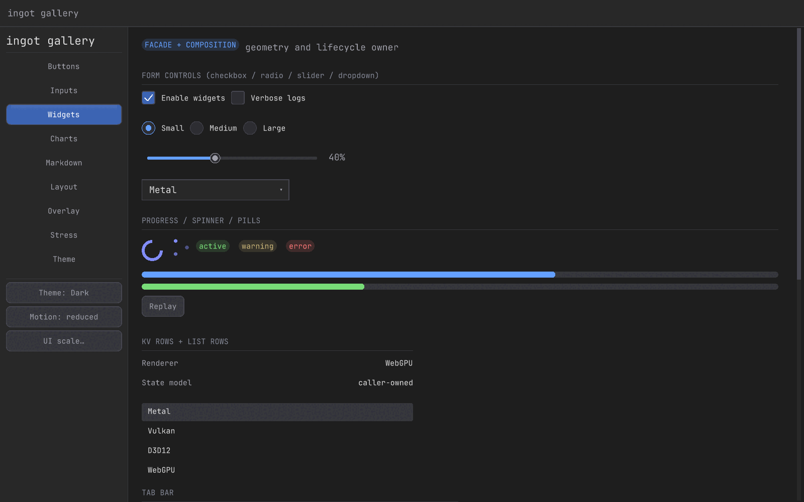
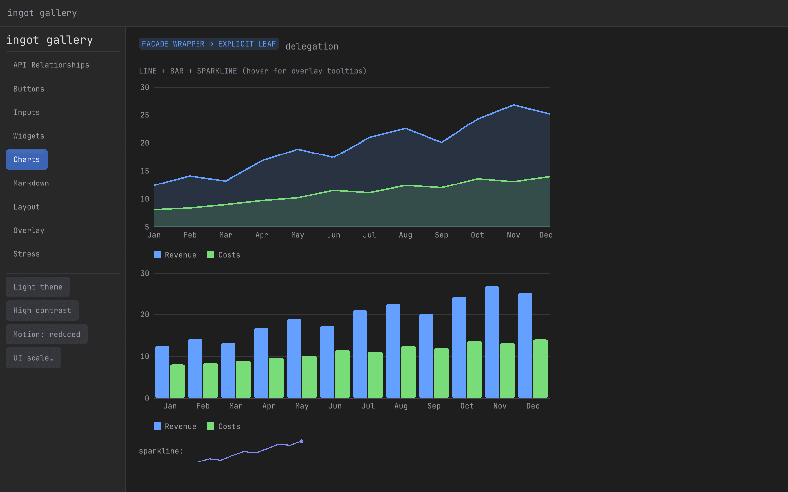
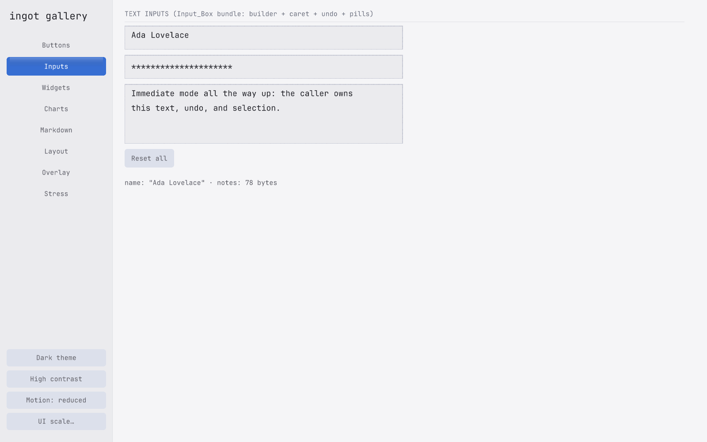
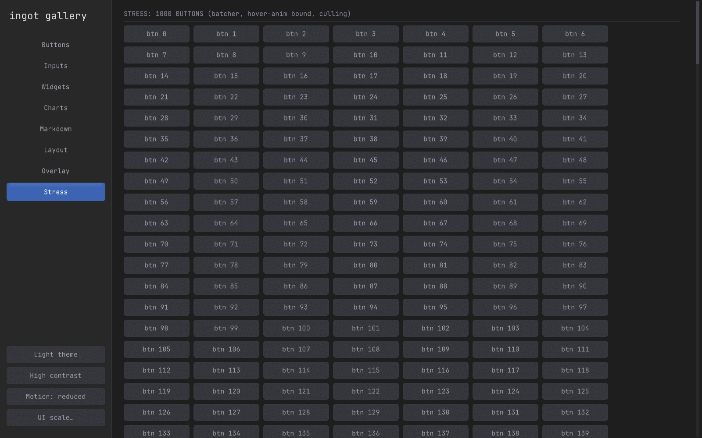
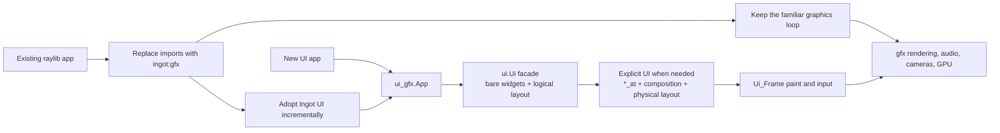

<p align="center">
  
</p>

<p align="center">
  <strong>The Odin app framework for polished native and web desktop tools—without Electron.</strong>
</p>

<p align="center">
  <a href="LICENSE"></a>
  <a href="CHANGELOG.md"></a>
</p>

<p align="center">
  <a href="https://openalloy.ai/ingot">Live demo and benchmarks</a> ·
  <a href="#why-ingot">Why Ingot</a> ·
  <a href="#quick-start">Quick start</a> ·
  <a href="#see-it-running">Gallery</a> ·
  <a href="#documentation">Documentation</a>
</p>

Ingot is a self-contained immediate-mode app framework with game-engine DNA,
built on Odin's bundled `vendor:wgpu`. One renderer targets macOS/Metal,
Windows/D3D12, Linux/Vulkan, and browser WASM/WebGPU. Two-dimensional games are
supported; polished desktop tools are the mission.

> [!IMPORTANT]
> `v0.1.0` is a source tag for a young `0.x` API. It may contain breaking
> changes, and target-specific production validation is not yet recorded. Pin
> an exact revision and validate every platform your application ships on.

## The experiment

Ingot asks whether deterministic simulation testing can shape an application
framework from its first subsystem rather than being added after the design has
settled. How quickly can that approach produce something useful, and how much
production behavior can run under generated input and failure conditions without
a window, GPU, network, shell, or assistive technology?

The experiment keeps application state explicit, confines nondeterminism to
compile-gated seams, bounds work and storage, and makes assertions plus derived
output the test oracles. Seeded harnesses then drive the code that ships while
replacing only edges such as sockets, platform input, and PTYs. The current
harnesses cover real widgets and text editing, HTTP and WebSocket failures,
worker synchronization, terminal pumping, frame scratch ownership, and selected
GPU lifetimes. See [Testing Ingot](docs/testing.md) for commands and exact scope.

This is evidence about one engineering approach, not a claim that simulation
proves correctness or that Ingot is already production-proven. Fuzzing currently
runs locally, native dependencies remain outside Odin-side sanitizer coverage,
and each target still needs validation on the operating systems, GPUs, browsers,
and accessibility stacks an application intends to ship. Real applications are
needed to establish where the approach remains useful and where it breaks down.


<details>
<summary><strong>More gallery views and reproducibility details</strong></summary>

| | |
|---|---|
|  |  |
|  |  |

Every image above is generated by `bash scripts/capture-media.sh`, which renders
`examples/gallery` into a fixed offscreen target and reads it back through
`gfx.SaveRenderTexturePng`. Reruns are byte-identical, so the media is evidence
rather than decoration.

</details>

## Why Ingot

| | |
|---|---|
| **One source, native + web** | Target macOS/Metal, Windows/D3D12, Linux/Vulkan, and browser WASM/WebGPU through one renderer and a small platform seam. |
| **Immediate mode all the way up** | Application state remains authoritative while each required frame derives interaction, focus, overlays, accessibility semantics, platform output, and paint. |
| **Built for desktop tools** | Windowing, batched 2D rendering, widgets, text, audio, gamepads, settings, networking, accessibility, and an optional terminal stack live in one framework. |
| **Idle when your app is idle** | Event-driven applications can skip UI construction and GPU submission until input, application work, or a redraw deadline requires a frame. |
| **Raylib-shaped graphics** | Familiar common-2D names ease migration without claiming complete raylib, raymath, shader, 3D, or `rlgl` parity. |
| **Testable by construction** | Explicit state and bounded output let deterministic harnesses drive production widgets and inspect focus, routing, semantics, and resource lifetimes. |

<details>
<summary><strong>Why the immediate-mode boundary matters</strong></summary>

Ingot's premise is that a retained widget tree is unnecessary. Anything a
retained GUI presents can be derived by declaring the current interface from
explicit application state whenever a frame is required. Persistence still
exists, but authoritative behavior belongs to the application or an explicit
runtime service rather than a hidden tree or label-hashed state store.

This follows the original single-path IMGUI idea: immediate mode describes the
interface between application and UI system, not stateless internals or
immediate GPU rendering. Ingot may retain caches, resources, and platform
snapshots, then batch paint through WebGPU. Event-driven applications can build
no UI frame and submit no GPU work while idle.

Ingot carries that boundary beyond a debug overlay. One declaration derives
interaction, focus, overlays, accessibility semantics, platform output, and
paint together as bounded data. That makes ownership visible and lets tests
drive real widgets, inspect output, and replay failures without reconstructing
a private object graph. This is a natural fit for Ingot's Tiger Style approach.

Read [Why immediate mode](docs/immediate-mode.md) for the argument and boundaries,
[Choosing Ingot](docs/comparison.md) for comparisons with other app and UI
stacks, [Choosing an API layer](docs/api-layers.md) for consumer boundaries,
[UI state and stable focus](docs/ui-state.md) for the ownership model, and
[Testing Ingot](docs/testing.md) for the deterministic and sanitizer-backed
harnesses.

</details>

## Packages

| Package | Role |
|---|---|
| `ingot:gfx` | Windowing, WebGPU rendering, shapes, textures, text, input, audio, cameras, and a raylib/rlgl-shaped API |
| `ingot:ui` | Renderer-independent immediate-mode widgets, layout, paint output, input snapshots, accessibility semantics, and themes |
| `ingot:ui_gfx` | Adapter that captures `gfx` input, replays UI paint output, and applies platform output |
| `ingot:prefs` | Native settings files and web `localStorage` behind one API |
| `ingot:net` | Background HTTP and reconnecting verified `ws://`/`wss://` WebSockets |
| `ingot:sys` | URLs, native file dialogs, and platform integration |
| `ingot:term` | libvterm, PTY pumping, and key-to-terminal translation |
| `ingot:libvterm` | Odin bindings and committed native static libraries |
| `ingot:accesskit` | Odin bindings and native static libraries for the AccessKit C API |
| `ingot:pty` | `forkpty` on Unix and ConPTY on Windows |
| `ingot:testx` | Deterministic test helpers for PRNG and inline snapshots |

## Installation

Add Ingot as a submodule and register it as an Odin collection:

```sh
git submodule add https://github.com/Nic-vdwalt/ingot.git libs/ingot
git -C libs/ingot checkout v0.1.0
odin build src -collection:ingot=libs/ingot
```

Pin the submodule to a tag or an exact revision in consumer CI; `0.x` tags may
break the API in any release. The tested Odin toolchain is
`dev-2026-06:285f6d87b`; put `odin` and the `odinfmt` bundled with that toolchain
on `PATH`. Native rendering also needs the wgpu-native library expected by
Odin's `vendor:wgpu` package. Terminal support needs the committed libvterm
library; native accessibility needs the AccessKit library for the target. See
[Testing Ingot](docs/testing.md#toolchain) for verification commands.

```odin
import rl "ingot:gfx"
import ui "ingot:ui"
import "ingot:ui_gfx"
```

## Choose your entry point



For a new desktop tool, start with `ui_gfx.App` and the bare `ui.Ui` facade
shown below. Drop to explicit UI only where application behavior owns geometry
or lifecycle. For an existing raylib application, begin with the documented
`ingot:gfx` import migration and keep its graphics loop; add `ui_gfx.App` and
the facade later only if the application needs Ingot widgets. See
[Choosing an API layer](docs/api-layers.md) for the complete ownership map.

## Quick start

```odin
package main

import rl "ingot:gfx"
import ui "ingot:ui"
import "ingot:ui_gfx"

App_Data :: struct {
	form: ui.Ui,
}

app: ui_gfx.App
app_data: App_Data

main :: proc() {
	flags: rl.ConfigFlags = {.WINDOW_RESIZABLE, .VSYNC_HINT}
	when ODIN_OS == .Darwin do flags += {.WINDOW_HIGHDPI}
	_ = ui_gfx.app_run(
		&app,
		{
			width = 960,
			height = 640,
			title = "Ingot app",
			flags = flags,
			session = {semantics_enabled = true},
		},
		{frame = frame},
		&app_data,
	)
}

frame :: proc(app: ^ui_gfx.App, frame: ^ui.Ui_Frame, userdata: rawptr) {
	data := cast(^App_Data)userdata
	root := ui_gfx.app_screen_rect(app)
	ui.begin(&data.form, frame, root, gap = .SM)
	ui.padding(&data.form, .LG)
	ui.scope_begin(&data.form, "welcome")
	ui.label(&data.form, "Hello from Ingot")
	if ui.button(&data.form, ui.id(&data.form, "continue"), "Continue", .Primary) {
		rl.TraceLog(.INFO, "Continue pressed")
	}
	ui.scope_end(&data.form)
	ui.end(&data.form)
}
```

Text takes a semantic *role* and *ink* rather than a raw size and color, so
call sites do not re-derive metrics and theme. `ui.text`, `ui.text_wrapped`,
`ui.text_truncated`, and `ui.text_width` resolve `Text_Role` against the
scaled `Ui_Metrics` and `Ink` against the active `Theme`. The explicit
`draw_text_frame` and `measure_text_frame` entry points remain available for
sizes and colors these enums do not name. Where drawing code needs both tables
at once, `ui.ui_frame_style(frame)` returns them together.

Ordinary leaf widgets ship in two geometry shapes. The bare facade takes a
`^Ui`, carves a logical slot, and interactive widgets also take a generated
`Widget_Id`; presentational widgets need no identity. The explicit `*_at` shape
takes a `^Ui_Frame` and an application-owned physical `Rect_I32`. Composition
protocols such as panes, modals, listboxes, overlays, and markdown stay explicit
under lifecycle or subsystem names. See
[application shell](docs/application-shell.md),
[layout conventions](docs/layout.md), and
[UI state and stable focus](docs/ui-state.md#widget-tiers).

`rl.run` blocks on native targets and installs the animation-frame callback on
web. State used by `frame` must therefore outlive `main` on web. A managed web
host must retain the session returned by `ingotWeb.run()` and call
`session.destroy()` before replacement, or `ingotWeb.stop()` during global page
teardown.

For an existing raylib application, start by replacing
`import rl "vendor:raylib"` with `import rl "ingot:gfx"` and
`vendor:raylib/rlgl` with `ingot:gfx/rlgl`. This import-only path targets common
2D call sites; other subsystems can require mechanical edits, behavior review,
or redesign. Follow [Migrating from raylib](docs/raylib-migration.md).

## See it running

`examples/gallery` is the living widget reference, including layout, text input,
overlays, charts, markdown, accessibility semantics, a 1,000-button stress view,
and an F12 metrics overlay.

```sh
odin run examples/gallery -collection:ingot=.
bash scripts/smoke-gallery.sh
```

The smoke script is a separate windowed GPU test, not part of `scripts/test.sh`.
It requires a working display and drives every scale, theme, and gallery section.

`bash scripts/capture-media.sh` is the other windowed tool. It rebuilds the
stills in `docs/media/` and the demo GIF/MP4 in `dist/media/` from the same
gallery, so refreshing the images above never involves a manual screenshot.

Other focused examples:

- `examples/hello` — canonical application shell, layout, and stable-ID usage.
- `examples/breakout` — audio, gamepad input, and web export from one source.
- `examples/idle_demo` — event-driven rendering at approximately zero idle CPU.
- `examples/chart_demo` — chart widgets and interaction.
- `examples/render_fixture` — renderer, resource-lifetime, and backend validation.
- `examples/raylib_migration_fixture` — import-only 2D compatibility contract.

Web builds require Bash, Python 3, and the pinned Odin toolchain. From the
repository root, `bash build_web.sh` writes `web/ingot_web.wasm`; serve `web/`
over HTTP and use a WebGPU browser (Chrome/Edge 113+ or Safari 18+).
`bash scripts/check-web.sh` compiles the gallery, Breakout, and default demo,
then runs dependency-free Node lifecycle and semantic tests. Each build replaces
the same WASM output, and the headless gate does not replace real-browser or
assistive-technology testing.

Consumer builds should use `scripts/stage-web-runtime.sh DEST`. It copies the
pinned Odin and WebGPU JavaScript runtimes, applies Ingot's compatibility
transform, and copies the managed host glue for external destinations. It does
not copy the application WASM or HTML entry point.

See [Networking](docs/networking.md) for HTTP/WebSocket lifecycle and ownership,
and [Compatibility and platforms](docs/compatibility.md) for browser, dialog,
preferences, terminal, accessibility, and versioning constraints.

## Measured performance

An accepted [2026-07-26 Apple M2 Max Phase 2 baseline](benchmarks/widgets/results/2026-07-26-m2-max-phase-2.md)
measured a deterministic 100-row dashboard with 1,000 submitted UI elements at a
46.21 µs total median and 53.46 µs total p95. The build median was 45.88 µs and
finalization p95 was 0.04 µs across seven fresh processes, each with 300 warm-up
and 2,000 measured frames. These are fixed-geometry headless-core CPU results,
not native host, GPU, presentation, memory, idle-power, or complete application
measurements. The earlier [cross-framework run](benchmarks/widgets/results/2026-07-26-m2-max-core.md)
remains workload-specific evidence for pinned Dear ImGui and egui adapters, not
an overall framework ranking.

## Documentation

- [Why immediate mode](docs/immediate-mode.md) — IMGUI's historical intent,
  Ingot's app-framework vision, state boundary, and Tiger Style fit.
- [Choosing Ingot](docs/comparison.md) — comparisons with immediate, retained,
  web, native, raylib, and full game-engine alternatives.
- [UI state and stable focus](docs/ui-state.md) — runtime/frame/component
  ownership, teardown, focus identity, and accessibility identity.
- [Interaction contract](docs/interaction-contract.md) — pointer, keyboard,
  focus, overlays, forms, accessibility, platform conventions, and approval gates.
- [Testing Ingot](docs/testing.md) — package tests, deterministic fuzzing,
  ASan/TSan, GPU validation, and reproducible seeds.
- [Widget benchmark](benchmarks/widgets/README.md) — pinned, reproducible core
  comparisons and dated results for Dear ImGui, egui, and Ingot at scale.
- [Rendering](docs/rendering.md) — renderer ownership, submission lifetime,
  render-target conventions, frame scheduling, and backend validation.
- [3D content pipeline plan](docs/3d-content-pipeline-plan.md) — proposed
  asset/scene package split, deterministic-simulation oracles, and phases.
- [Migrating from raylib](docs/raylib-migration.md) — supported 2D profile,
  compatibility matrix, conversion workflow, examples, and validation checklist.
- [Networking](docs/networking.md) — HTTP and WebSocket lifecycle, ownership,
  limits, security, and native/web differences.
- [Compatibility and platforms](docs/compatibility.md) — toolchain pinning,
  support policy, browser hosting, system integration, and native dependencies.
- [Production readiness](docs/production-readiness.md) — security boundaries,
  release validation matrix, and remaining platform work.
- [Tiger Style](docs/TIGER_STYLE.md) — safety, performance, assertions, bounds,
  memory discipline, and contribution rules.
- [Changelog](CHANGELOG.md) — released versions, and what each one does and does
  not claim to have validated.

## Development

```sh
bash scripts/test.sh
bash scripts/check.sh
bash scripts/check-web.sh
python3 benchmarks/widgets/runner/bench.py smoke
```

Read [CONTRIBUTING.md](CONTRIBUTING.md) before submitting changes and report
vulnerabilities through the private process in [SECURITY.md](SECURITY.md).
New third-party or generated artifacts require the provenance evidence described
in [the source publication checklist](docs/source-publication-checklist.md).

The project prioritizes safety, then performance, then developer experience.
New and changed code follows bounded control flow, explicit ownership, strict
checking, and an average target of at least two assertions per procedure.

## Direction

The near-term priority remains proof over feature count: validate every native
WebGPU backend, publish the live gallery, document raylib migration, report
concrete idle CPU, binary-size, build-time, and frame-work measurements, and
reach Linux desktop-polish parity.

The remaining maturity priorities, including the gaps against focused embeddable
layout libraries such as Clay, are:

1. **Platform evidence:** replace every `Not recorded` release-matrix entry with
   revision-pinned macOS, Linux, Windows, browser, TLS, GPU, and accessibility
   evidence without treating compile-only or Node-only checks as validation.
2. **Multi-context proof:** validate simultaneous native windows on Metal,
   Vulkan, and D3D12, including independent input/resources, interleaved frames,
   close/recreate behavior, and stale or cross-context handle rejection.
3. **Portable integration:** reduce the integration surface, document renderer
   and host boundaries, publish focused embedding examples, and measure build
   time and binary size. Ingot remains Odin-first rather than pursuing Clay's
   single-header C portability.
4. **Layout confidence:** expand the bounded explicit-size flow beyond its initial
   fuzzing, responsive gallery fixture, and geometry benchmark with clipping,
   focus, accessibility, and real-application evidence while preserving bounded
   work and explicit caller-owned state.

These are release gates and engineering targets, not claims of completed
validation. Detailed evidence requirements remain in
[`docs/production-readiness.md`](docs/production-readiness.md).

Advanced widgets will be built in dependency order:

1. **Collection foundation:** a bounded two-axis virtual viewport, visible-range
   calculation, scroll-to-item behavior, stable selection, keyboard navigation,
   and composite accessibility semantics.
2. **Virtualized data views:** list, searchable combo box and command palette,
   then sortable and resizable data grid, tree view, and property grid widgets.
3. **Workspace composition:** tabs and resizable split panes, followed by a
   serializable docking workspace with keyboard-accessible drag targets.
4. **Terminal view:** package the existing PTY and libvterm core as a reusable
   widget with styled cells, selection, clipboard, scrollback, and resize support.
5. **Remote editor surface:** provide bounded cell-grid state, dirty-row paint,
   cursor and selection input, overlays, and accessibility for applications that
   embed an editing engine such as Neovim. Protocol adapters and renderer-specific
   render-target caching remain application-owned.
6. **Code editor:** build an optional native editor on scalable text storage,
   styled runs, two-axis virtualization, gutters, diagnostics, and complete IME
   handling rather than requiring it for embedded-engine applications.

Each stage must preserve caller-owned state, bounded frame work, event-driven
idle behavior, stable focus, and accessibility across native and web targets.

A 3D content pipeline, mobile targets, scripting layers, visual designers, and
game or content-production editors remain out of scope. Ingot's optional 3D path
is a visualization escape hatch rather than a scene-graph engine.

## License and release status

Ingot's original source is licensed under the [Apache License 2.0](LICENSE).
Bundled third-party works retain their own licenses; see [NOTICE](NOTICE),
[third-party notices](THIRD_PARTY_NOTICES.md), and the
[artifact manifest](docs/provenance/third-party-artifacts.json).

Making the source repository public does not establish production readiness or
authorize binary, installer, or web-bundle distribution. Complete the
[source publication checklist](docs/source-publication-checklist.md) before a
visibility change and the [binary and web release checklist](docs/oss-release-checklist.md)
before redistributing release artifacts.

`v0.1.0` is the first published tag. It is a source tag: no binaries, installers,
or web bundles are attached, and every row of the release validation matrix
remains `Not recorded`. See the [changelog](CHANGELOG.md) for what that release
does and does not claim.
