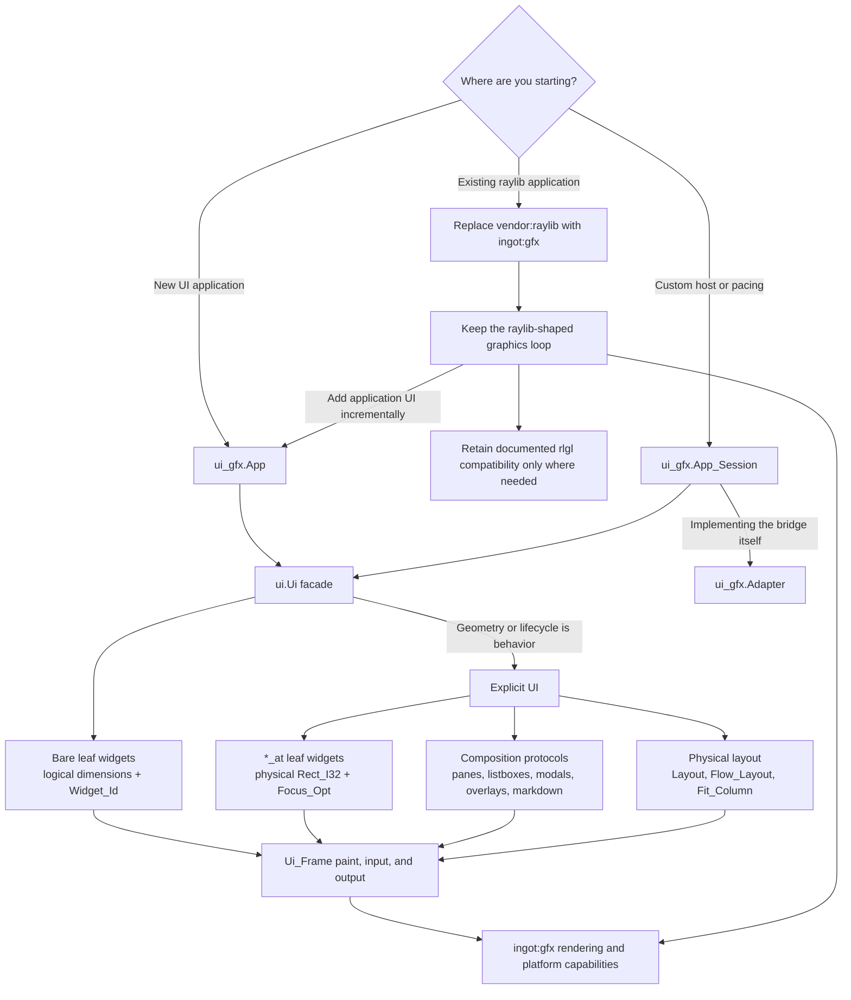

# Choosing an API layer

Ingot exposes several layers so applications can choose how much lifecycle,
layout, rendering, and platform work the framework owns. Start at the highest
layer that satisfies the requirement. Move down only for a concrete capability
that the higher layer cannot express.

A lower layer is not a more capable default. It transfers ownership of ordering,
scaling, focus, accessibility, resource lifetime, portability, and testing to the
application. Keep each escape hatch narrow and return to the higher layer at its
boundary.

## Entry paths

The two common paths deliberately begin in different places:

1. **New desktop tools:** start at `ui_gfx.App`, compose ordinary controls with
   the bare `ui.Ui` facade, and introduce small explicit regions only where the
   application owns placement or a composition lifecycle.
2. **Raylib migrations:** first replace the graphics imports and preserve the
   existing loop. This does not require adopting `ui.Ui`. Add the app shell and
   facade incrementally when the migrated application needs conventional UI.

## Quick choices

- Typical one-window UI application: `ui_gfx.App`.
- Custom pacing, embedding, multiple contexts, or unusual submission order:
  `ui_gfx.App_Session`.
- Renderer/platform integration: `ui_gfx.Adapter`.
- Forms, settings, toolbars, and panels: `ui.Ui` and facade widgets.
- Canvases, virtualized or scrolled content, overlays, and custom hit regions:
  `*_at`, explicit composition, and physical layout.
- Ordinary UI drawing and input: `Ui_Frame` paint and input snapshots.
- Windowing, textures, audio, cameras, and custom GPU content: `ingot:gfx`.
- Raylib source migration where behavior is documented: `ingot:gfx/rlgl`.
- General URL requests: `http_request_url`; background or web HTTP: `Fetcher`.
- Reconnecting WebSockets: URL-based `ws_start_connect_url`.
- Settings, cache paths, dialogs, and URLs: `ingot:prefs` and `ingot:sys`.
- Terminal lifecycle and pumping: `ingot:term`.
- FFI or platform implementation: bindings such as `libvterm`, `pty`, and `accesskit`.

## Application hosting

### `ui_gfx.App`: default host

Use `App` for a normal one-window application. It owns the default graphics
context, an `App_Session`, frame acquisition and submission, temporary-frame
cleanup, and teardown ordering. The application still owns its state, widget
components, textures, and other persistent resources.

Choose this layer unless a requirement names something the shell cannot do. An
application should not manually assemble `Ui_Runtime`, `Ui_Frame`, `Ui_Input`,
`Ui_Output`, and `Adapter` merely to control its own state; `App` already leaves
that state caller-owned.

### `ui_gfx.App_Session`: custom host

Use `App_Session` when the application must own the frame loop while retaining
Ingot's standard UI lifecycle. Examples include:

- adaptive or externally coordinated pacing;
- explicit minimized-window event pumping;
- embedding in another host;
- multiple graphics contexts;
- custom instrumentation around acquisition and submission; or
- an unusual ordering requirement that `app_run` cannot provide.

`App_Session` owns the runtime, reusable frame, input/output values, adapter, DPI
refresh, accessibility finalization, and their teardown order. The host owns the
graphics window and brackets graphics frames around
`app_session_begin_frame_context` and `app_session_end_frame_context`.

### `ui_gfx.Adapter`: bridge implementation

`Adapter` is the renderer/platform bridge, not an application shell. Direct use
requires the host to initialize and destroy `Ui_Runtime` and `Ui_Frame`, capture
input, refresh DPI, finalize accessibility, replay output, reclaim temporary
allocations, and preserve teardown order.

Use it directly only when implementing or replacing those policies. Custom
pacing alone is not sufficient reason; that is the `App_Session` layer. If a
consumer repeats the fields of `App_Session` beside an `Adapter`, it should
normally migrate to `App_Session`.

See [Application shell](application-shell.md) for lifecycle examples and exact
ownership order.

## UI composition

### `ui.Ui`: ordinary interface

Start forms, panels, settings, toolbars, and conventional application chrome
with `ui.begin`. Use facade widgets such as `button`, `text_input`, `checkbox`,
and `spinner`. This tier owns slot carving, logical-to-physical scaling, stable
widget identity, focus registration, semantics, interaction, and paint emission.

Use scoped `Widget_Id` values for conditional controls, collections, and reusable
components. Labels are presentation and accessibility data, not identity.

### Explicit geometry: application-owned placement

Use `*_at`, `Layout`, `Flow_Layout`, `Fit_Column`, and explicit composition
protocols when exact placement is part of application behavior. Appropriate
cases include canvases, maps, timelines, overlays, scroll-offset content,
virtualized lists, custom hit regions, and components with measured external
content.

Explicit APIs are first-class, not deprecated. They take physical pixels and
transfer scaling and geometry ownership to the caller. Do not use them for a
fixed form solely because its rectangles are easy to calculate; the facade
keeps DPI, focus, and later layout changes centralized.

A screen may mix tiers. Let the facade own ordinary controls, reserve an explicit
slot for custom content, draw that content through the frame, and then continue
with facade layout.

See [Layout conventions](layout.md) and
[UI state and stable focus](ui-state.md) for units, identity, and component
ownership.

## Rendering and input

Ordinary views should consume the `Ui_Input` snapshot through `Ui_Frame` queries
and emit to the UI paint list. This preserves one input snapshot per frame,
clipping and pane transforms, deferred replay, accessibility synchronization,
headless tests, and renderer independence.

Use `ingot:gfx` directly for capabilities outside the paint model: windowing,
textures and image blits, audio, cameras, render targets, shaders, supported GPU
3D, and specialized native renderers. Keep those calls in a narrow renderer or
host boundary. Feed view decisions from captured frame input rather than polling
`gfx` again after UI input capture.

`ingot:gfx/rlgl` is a source-migration compatibility shim. It is not a general
OpenGL layer. New code should prefer `gfx` drawing, render targets, shaders, or
the explicit GPU 3D API. Before retaining an `rlgl` call, verify that
[Compatibility](compatibility.md) documents real behavior; some raylib concepts
have no WebGPU equivalent and intentionally do not compile.

## Networking and platform services

Use URL-based networking interfaces for new code:

- `http_request_url` for a direct bounded request to a general `http://` or
  `https://` URL;
- `Fetcher` for background work, event-driven applications, browser builds,
  priority, or native cache files; and
- `ws_start_connect_url` for reconnecting `ws://` or verified `wss://` sockets.

The host/port HTTP procedures and `ws_start_connect` are legacy plaintext
compatibility paths. They are not simpler security tiers. Prefer explicit URLs,
set body limits, handle queue backpressure, drain ownership, and use redraw wake
hooks for event-driven native applications. See [Networking](networking.md).

Use `prefs` rather than choosing native files versus browser storage in
application code. Use `sys` for cache directories, external URLs, and dialogs.
Platform-specific implementations belong below these packages unless the
cross-platform contract cannot represent the required behavior.

## Terminal stack and bindings

Use `ingot:term` for terminal creation, PTY lifecycle, key translation, and
bounded per-frame pumping. It intentionally leaves terminal rendering to the
application, so a specialized renderer may read terminal cells and scrollback.
Direct `libvterm` access is appropriate for cell rendering, selection, and a
feature absent from `term`; direct `pty` access is appropriate only when building
a different terminal lifecycle.

`ingot:libvterm`, `ingot:pty`, and `ingot:accesskit` are bindings and
implementation layers. Ordinary application features should not bypass `term`
or `ui_gfx` to call them.

## Consumer review checklist

When reviewing an Ingot consumer, check boundaries rather than counting low-level
imports:

1. Does a one-window app manually reproduce `App` or `App_Session` ownership?
2. Do ordinary forms calculate rectangles and focus wiring instead of using
   `ui.Ui`?
3. Do ordinary views poll `gfx` after input capture or draw outside the paint
   list?
4. Are direct `gfx` calls isolated to capabilities the paint list lacks?
5. Are `rlgl` calls documented as supported compatibility behavior rather than
   assumed OpenGL state?
6. Do network calls use URL-based secure APIs and explicit bounds?
7. Do applications use `prefs`, `sys`, and `term` before platform bindings?
8. Does every lower-layer exception state the missing higher-layer capability?

Lower-level use is justified when the answer is specific: a shader-backed scene,
a terminal cell renderer, minimized-window event pumping, or custom submission
instrumentation. It is accidental when the answer is only that the consumer was
written before the higher layer existed.

## Guidance from existing consumers

Existing consumers demonstrate both cases:

- A custom loop with minimized-window event pumping, backend ticks, GPU resource
  ordering, and instrumentation can justify `App_Session` rather than `App`.
  Those requirements do not by themselves justify assembling `Adapter` and all
  of its owned UI values manually.
- A map or virtualized view can justify explicit geometry while its setup forms
  and ordinary panels still use the `Ui` facade.
- Shader, render-target, image-texture, terminal-grid, and native editor
  renderers can justify direct `gfx`; neighboring controls should remain on the
  paint/input boundary.

Treat migration as boundary tightening, not a rewrite. Replace duplicated host
ownership with `App_Session`, move ordinary controls to the facade, and preserve
small explicit renderer islands where Ingot has no higher-level equivalent.
