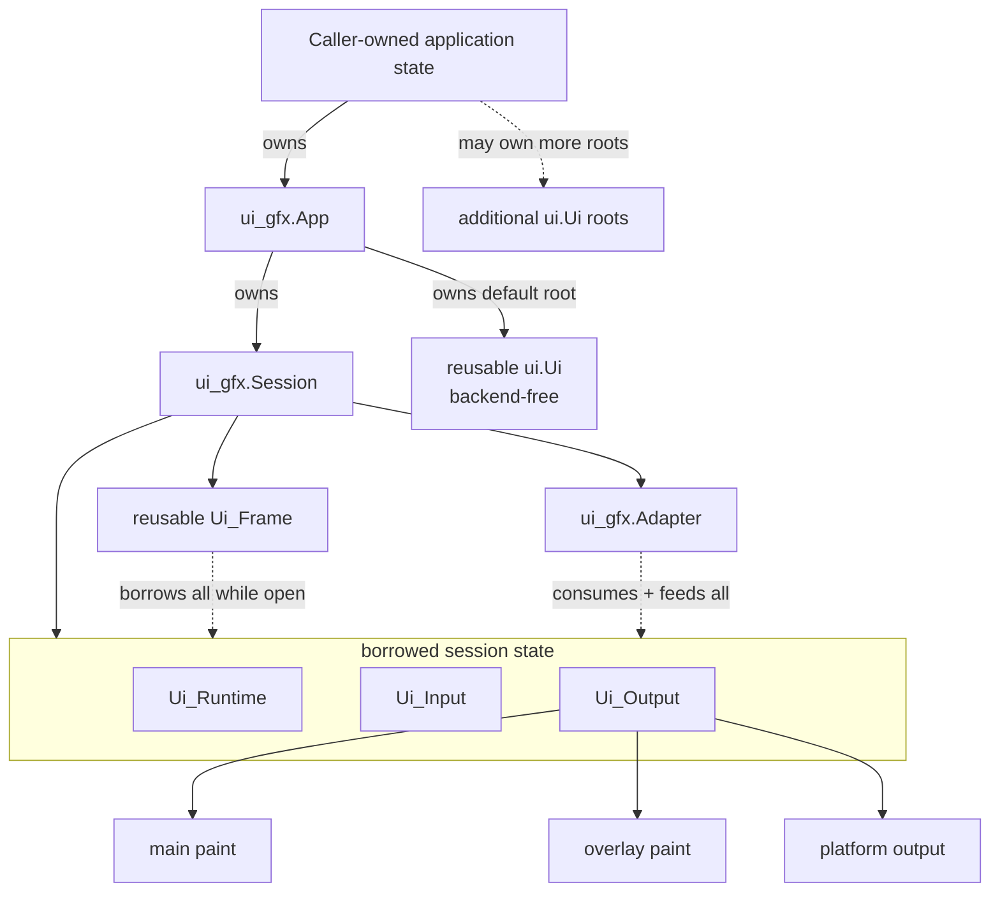
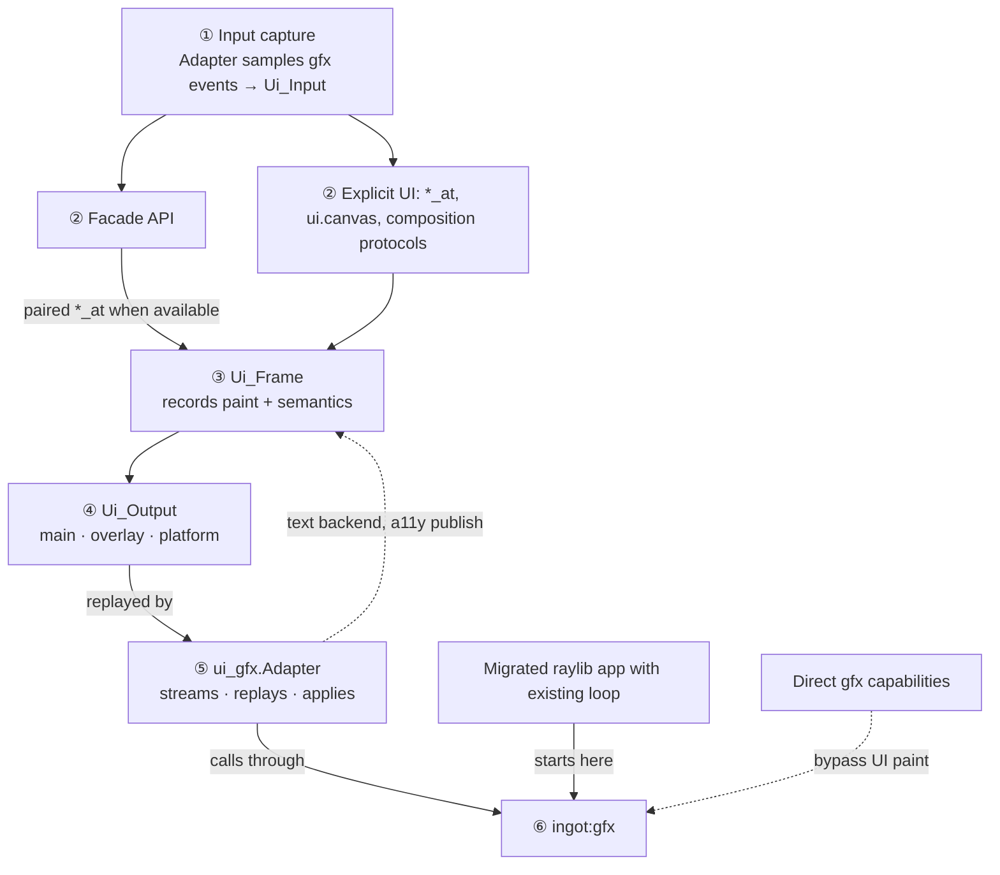

# Choosing an API layer

Ingot exposes several layers so applications can choose how much lifecycle,
layout, rendering, and platform work the framework owns. Start at the highest
layer that satisfies the requirement. Here, **highest** means the most
framework-owned policy appropriate to that axis, not one total ordering across
hosting, geometry, composition, and rendering. Move down only for a concrete
capability that the higher layer cannot express.

A lower layer is not a more capable default. It transfers ownership of ordering,
scaling, focus, accessibility, resource lifetime, portability, and testing to the
application. Keep each escape hatch narrow and return to the higher layer at its
boundary.

Facade leaves are ergonomic wrappers around explicit leaves where paired forms
exist. They add slot carving, logical scaling, stable identity, and focus
registration before delegating. Explicit composition protocols are separate
peers and may have no facade form by design.

## Entry paths

Solid edges are ownership (struct fields); dashed edges are frame-time
borrowing, and they are complete — no references are omitted. The five Session
members are siblings; `Ui_Output` does not live inside `Ui_Frame`, and
`Adapter` does not own what it touches. While a frame is open, `Ui_Frame`
borrows all three passive members: runtime services, input reads, output
writes. `Adapter` likewise touches all three: it feeds `Ui_Runtime` a text
backend, captures platform events into `Ui_Input`, and consumes `Ui_Output`.
The call-path diagram below shows the same relationships as dataflow.

The ownership tree is literal. `App` contains `Session` and its reusable `Ui`
form as sibling fields. `Session` contains five peer fields: the runtime,
reusable frame, input, output, and Adapter. `Ui_Output` contains the main paint,
overlay paint, and platform-output groups.

`ui.Ui` is deliberately standalone: the `ingot:ui` package imports only
`core:*`, so a `Ui` root knows nothing about graphics. It is one logical root
over one rectangle, attaching to a frame only between `ui.begin` and `ui.end`,
and it persists across frames to keep Tab-focus order. A frame may host any
number of caller-owned roots; the `App`-owned form is only the default for the
`ui` callback path.

The call-path graph runs from application-facing entry points toward the
backend-facing API in per-frame order; it is not ownership. The six phases of
one frame are: ① Adapter captures platform events into the `Ui_Input` snapshot,
② facade or explicit UI reads that snapshot and declares widgets, ③ `Ui_Frame`
records paint, semantics, and platform requests, ④ `Ui_Output` buffers the
three channels, ⑤ Adapter streams main paint, replays overlay, and applies
platform output, ⑥ `ingot:gfx` executes the backend calls. `Ui_Frame`
temporarily references the Session-owned runtime, input, and output while a
frame is open. Adapter likewise references the active graphics context and
frame rather than owning them.

`Adapter` is a two-way bridge, not just a replay sink. Downstream it translates
UI output into `gfx` calls; upstream it lends `Ui_Runtime` a text backend for
measurement and shaping and publishes the accessibility tree after
finalization. The migrated-raylib route sits outside the frame cycle entirely.

`Ui_Output` has distinct replay timing. Main paint passes through the Adapter
sink as commands are emitted, overlay paint is replayed at frame end, and
platform output is applied through the Adapter/platform bridge. The detached
direct-capability route intentionally bypasses UI paint.

The two common paths deliberately begin in different places:

1. **New desktop tools:** start at `ui_gfx.App`, compose ordinary controls with
   the bare `ui.Ui` facade, and introduce small explicit regions only where the
   application owns placement or a composition lifecycle.
2. **Raylib migrations:** first replace graphics imports and preserve the existing
   loop at `ingot:gfx`. Add `ui_gfx.Session` when the preserved loop needs UI, or
   replace the loop with `ui_gfx.App` when the default application host fits.

## Quick choices

- Typical one-window UI application: `ui_gfx.App`.
- Custom pacing, embedding, multiple contexts, or unusual submission order:
  `ui_gfx.Session`.
- Renderer/platform integration: `ui_gfx.Adapter`.
- Forms, settings, toolbars, and panels: `ui.Ui` and facade widgets.
- Canvases, virtualized or scrolled content, overlays, and custom hit regions:
  `*_at`, explicit composition, and physical layout.
- Ordinary UI drawing and input: `Ui_Frame` paint and input snapshots.
- Owned direct drawing: `gfx.Frame`; window, input, resources, and hosting:
  `gfx.Context` procedures.
- Raylib source migration where behavior is documented: the PascalCase
  `ingot:gfx` and `ingot:gfx/rlgl` facade.
- General URL requests: `http_request_url`; background or web HTTP: `Fetcher`.
- Reconnecting WebSockets: URL-based `ws_start_connect_url`.
- Settings, cache paths, dialogs, and URLs: `ingot:prefs` and `ingot:sys`.
- Tool-authored or shipped UI descriptions: `ingot:view`.
- Terminal lifecycle and pumping: `ingot:term`.
- FFI or platform implementation: bindings such as `libvterm`, `pty`, and `accesskit`.

## Application hosting

### `ui_gfx.App`: default host

Use `App` for a normal one-window application. `app_run` binds it to the default
graphics context and owns a `Session`, frame acquisition and submission,
temporary-frame cleanup, and teardown ordering. Native custom hosts may bind an
App to a caller-owned context with `app_init_context` and drive one bounded tick
at a time. The application still owns its state, contexts, widget components,
textures, and other persistent resources.

Choose this layer unless a requirement names something the shell cannot do. An
application should not manually assemble `Ui_Runtime`, `Ui_Frame`, `Ui_Input`,
`Ui_Output`, and `Adapter` merely to control its own state; `App` already leaves
that state caller-owned.

### `ui_gfx.Session`: custom host

Use `Session` when the application must own the frame loop while retaining
Ingot's standard UI lifecycle. Examples include:

- adaptive or externally coordinated pacing;
- explicit minimized-window event pumping;
- embedding in another host;
- multiple graphics contexts;
- custom instrumentation around acquisition and submission; or
- an unusual ordering requirement that `app_run` cannot provide.

`Session` owns the runtime, reusable frame, input/output values, adapter, DPI
refresh, accessibility finalization, and their teardown order. The host owns the
graphics window and normally brackets drawing with `session_acquire_frame` and
`session_present_frame`. The returned `Session_Frame` keeps the UI and graphics
owners paired without allocating or retaining application state. Hosts that
must separate those boundaries may continue to use
`session_begin_frame_context` and `session_end_frame_context`, while assuming
graphics submission and frame-temporary cleanup themselves.

### `ui_gfx.Adapter`: bridge implementation

`Adapter` is the renderer/platform bridge, not an application shell. Direct use
requires the host to initialize and destroy `Ui_Runtime` and `Ui_Frame`, capture
input, refresh DPI, finalize accessibility, replay output, reclaim temporary
allocations, and preserve teardown order.

Use it directly only when implementing or replacing those policies. Custom
pacing alone is not sufficient reason; that is the `Session` layer. If a consumer
repeats the values owned by `Session` beside an `Adapter`, it should migrate to
`Session`.

See [Application shell](application-shell.md) for lifecycle examples and exact
ownership order.

## UI composition

### Flow UI: `ui.Ui`

Start forms, panels, settings, toolbars, and conventional application chrome
with the `App` UI callback or `ui.begin` in a custom host. Use facade widgets
such as `button`, `text_input`, `checkbox`, and `spinner`. This tier owns slot
carving, logical-to-physical scaling, stable widget identity, focus registration,
semantics, interaction, and paint emission.

Facade controls accept stable string/u64 keys directly. Pass a precomputed
`Widget_Id` for domain IDs or hot loops. Use `scope` for balanced component and
collection namespaces; `scope_begin`/`scope_end` remain the explicit form. Labels
are presentation and accessibility data, not identity.

### Canvas UI: application-owned placement

Use `*_at`, `Layout`, `Flow_Layout`, `Fit_Column`, and explicit composition
protocols when exact placement is part of application behavior. Appropriate
cases include canvases, maps, timelines, overlays, scroll-offset content,
virtualized lists, custom hit regions, and components with measured external
content.

Explicit APIs are first-class, not deprecated. They take logical screen pixels and
transfer scaling and geometry ownership to the caller. Do not use them for a
fixed form solely because its rectangles are easy to calculate; the facade
keeps DPI, focus, and later layout changes centralized.

A screen may mix modes. Let Flow UI own ordinary controls and use `canvas` to
reserve a logical slot and run a balanced explicit callback inside it. Use
`canvas_begin` and `canvas_end` directly only when the caller already owns a
screen-space rectangle or needs a manual lifecycle. Canvas paint is renderer-independent;
use direct `gfx` only when its paint commands cannot express the content.

See [Layout conventions](layout.md) and
[UI state and stable focus](ui-state.md) for units, identity, and component
ownership.

## Rendering and input

Ordinary views should consume the `Ui_Input` snapshot through `Ui_Frame` queries
and emit to the UI paint list. This preserves one input snapshot per frame,
clipping and pane transforms, deferred replay, accessibility synchronization,
headless tests, and renderer independence.

Use `ingot:gfx` directly for capabilities outside the paint model: windowing,
textures and image blits, audio, cameras, render targets, shaders, supported GPU
3D, CPU 3D picking, and specialized native renderers. Keep those calls in a
narrow renderer or host boundary. Feed the screen position used for
`screen_to_world_ray` from captured frame input rather than polling `gfx` again
after UI input capture.

`ingot:gfx/rlgl` is a source-migration compatibility shim. It is not a general
OpenGL layer. New code should prefer `gfx` drawing, render targets, shaders, or
the explicit GPU 3D API. Before retaining an `rlgl` call, verify that
[Compatibility](compatibility.md) documents real behavior; some raylib concepts
have no WebGPU equivalent and intentionally do not compile.

## Networking and platform services

Use URL-based networking interfaces for new code:

- `http_request_url` for a direct bounded request to a general `http://` or
  `https://` URL;
- `Fetcher` for background work, event-driven applications, browser builds,
  priority, or native cache files; and
- `ws_start_connect_url` for reconnecting `ws://` or verified `wss://` sockets.

The host/port HTTP procedures and `ws_start_connect` are legacy plaintext
compatibility paths. They are not simpler security tiers. Prefer explicit URLs,
set body limits, handle queue backpressure, drain ownership, and use redraw wake
hooks for event-driven native applications. See [Networking](networking.md).

Use `prefs` rather than choosing native files versus browser storage in
application code. Use `sys` for cache directories, external URLs, and dialogs.
Platform-specific implementations belong below these packages unless the
cross-platform contract cannot represent the required behavior.

## Saved views

`ingot:view` is an optional layer above `ui`, not beside it. A **view** is a
declarative description of a UI that a tool can author, save, ship, and diff;
`view.view_play` walks it and calls the same public `^Ui` facade an application
would call by hand. It depends on `ui` and nothing else, and `ui` does not know
it exists.

Use it when the UI is authored rather than written: a builder, a form defined by
configuration, or a screen a non-programmer edits. Do not use it for ordinary
application UI. A hand-written frame procedure is clearer, is fully checked by
the compiler, and can express everything the format deliberately cannot.

The format is narrower than the facade on purpose. It covers layout containers,
buttons, the core form controls, and presentational widgets; charts, dropdowns,
listboxes, and anything needing an array binding or retained widget state are
excluded from version 1. A node kind that `view_play` cannot render does not
exist, which is what keeps the document and the renderer from drifting.

Two consumption paths, both playing the same document through the same code:

- **Generated source.** `tools/viewc` emits a static `View` literal. Nothing is
  parsed at run time, every enum and index is checked by the compiler, and a
  format change becomes a compile error. Prefer this for a view that ships.
- **Loaded data.** `#load` or read the `.ingv`, then call `view.view_decode`.
  Required on web, and required whenever the view is not known at build time.

A view owns no state. The document describes structure; the consumer supplies a
`view.Bindings` table of pointers and reads interaction back from an event sink.
That table is the interface a consumer implements, and identity comes from
author-assigned keys, so a control keeps its state across relabelling,
reordering, and process restarts.

`view.view_decode` validates: it returns `ok = false` for any malformed input
and never asserts on file content. A view from an untrusted source is made safe
by that validation, not by its checksum. See
[the view format](view-format.md).

## Terminal stack and bindings

Use `ingot:term` for terminal creation, PTY lifecycle, key translation, and
bounded per-frame pumping. It intentionally leaves terminal rendering to the
application, so a specialized renderer may read terminal cells and scrollback.
Direct `libvterm` access is appropriate for cell rendering, selection, and a
feature absent from `term`; direct `pty` access is appropriate only when building
a different terminal lifecycle.

`ingot:libvterm`, `ingot:pty`, and `ingot:accesskit` are bindings and
implementation layers. Ordinary application features should not bypass `term`
or `ui_gfx` to call them.

## Consumer review checklist

When reviewing an Ingot consumer, check boundaries rather than counting low-level
imports:

1. Does a one-window app manually reproduce `App` or `Session` ownership?
2. Do ordinary forms calculate rectangles and focus wiring instead of using
   `ui.Ui`?
3. Do ordinary views poll `gfx` after input capture or draw outside the paint
   list?
4. Are direct `gfx` calls isolated to capabilities the paint list lacks?
5. Are `rlgl` calls documented as supported compatibility behavior rather than
   assumed OpenGL state?
6. Do network calls use URL-based secure APIs and explicit bounds?
7. Do applications use `prefs`, `sys`, and `term` before platform bindings?
8. Does every lower-layer exception state the missing higher-layer capability?

Lower-level use is justified when the answer is specific: a shader-backed scene,
a terminal cell renderer, minimized-window event pumping, or custom submission
instrumentation. It is accidental when the answer is only that the consumer was
written before the higher layer existed.

## Guidance from existing consumers

Existing consumers demonstrate both cases:

- A custom loop with minimized-window event pumping, backend ticks, GPU resource
  ordering, and instrumentation can justify `Session` rather than `App`.
  Those requirements do not by themselves justify assembling `Adapter` and all
  of its owned UI values manually.
- A map or virtualized view can justify explicit geometry while its setup forms
  and ordinary panels still use the `Ui` facade.
- Shader, render-target, image-texture, terminal-grid, and native editor
  renderers can justify direct `gfx`; neighboring controls should remain on the
  paint/input boundary.

Treat migration as boundary tightening, not a rewrite. Replace duplicated host
ownership with `Session`, move ordinary controls to the facade, and preserve
small explicit renderer islands where Ingot has no higher-level equivalent.

## Additive API migration

| Before | Preferred |
|---|---|
| `App_Callbacks{frame = draw}` plus manual `begin`/`end` | `App_Callbacks{ui = draw}` |
| `button(u, id(u, "save"), "Save", .Primary)` | `button(u, "save", "Save", Button_Options{style = .Primary})` |
| `scope_begin`; body; `scope_end` | `scope(u, key, body, userdata)` |
| `canvas_begin`; body; `canvas_end` after carving a slot | `canvas(u, options, body, userdata)` |
| long optional positional widget arguments | one zero-useful named options literal |

The original signatures remain compatibility overloads. Explicit IDs,
`scope_begin`/`scope_end`, `canvas_begin`/`canvas_end`, `*_at`, `Session`, and
`Adapter` remain first-class APIs rather than deprecated paths.
